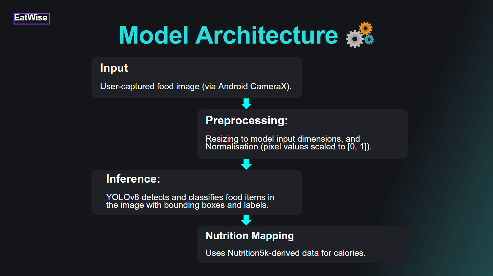
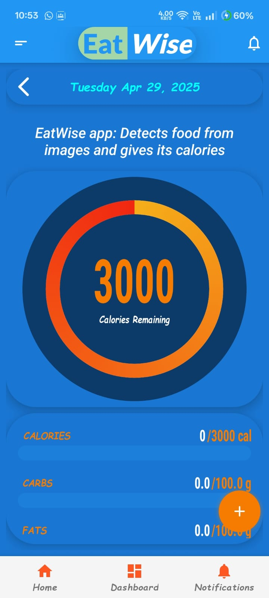
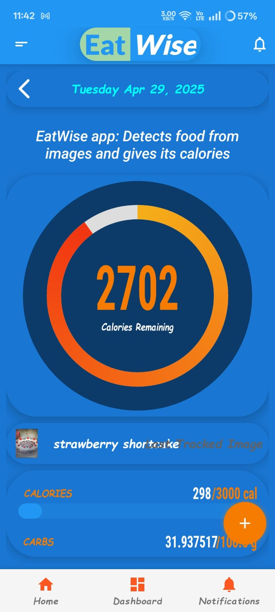

# 🍽️ EatWise

**AI-Powered Food Classification and Nutrition Analysis App**

EatWise is an AI-driven Android application that enables users to automatically identify food items from images and view detailed nutritional information. Designed with a focus on Indian dietary habits, EatWise eliminates the need for manual logging and supports localized food classification.

---

## 🧠 Problem Statement

Most nutrition tracking apps struggle with Indian diets. Global AI models often misclassify dishes like dal, chapati, or rajma, leading to inaccurate nutrition logs. EatWise solves this by integrating a custom-trained AI model that recognizes regional food items and maps them to accurate nutritional values.

---

## 🚀 Key Features

- 📷 **Real-time Food Classification**: Capture food images using Android’s CameraX API and instantly classify them using a YOLOv8-based deep learning model.
- 🧠 **Nutrition Analysis**: Shows calorie, carbohydrate, and nutrient breakdown for each food item detected.
- 🇮🇳 **Indian Cuisine Support**: Custom dataset includes common items from IIT Jodhpur's canteen, mess, and Shamiyana.
- ⚡ **On-Device Inference**: Lightweight TensorFlow Lite model ensures fast predictions without relying on internet access.
- 📱 **User-Friendly Interface**: Simple UI to track meals and remaining calories for the day.

---

## 🏗️ System Architecture




---

## 📱 App Screenshots

- **Home Screen**: Displays daily calorie goals and consumed values.
- **Results Screen**: Shows food classification and nutrition facts.

<p align="center">
  
  
</p>

---

## 🧪 Tech Stack

| Component            | Technology                     |
|----------------------|---------------------------------|
| Mobile App           | Android Studio (Kotlin)         |
| Image Capture        | CameraX API                     |
| Deep Learning Model  | YOLOv8 (CNN)                    |
| On-device Inference  | TensorFlow Lite (.tflite)       |
| Datasets Used        | Food-101, Nutrition5k, IITJ Food Dataset |

---

## 🗃️ Datasets

- **Food-101**: General food classification.
- **Nutrition5k**: Used to derive macronutrient values for known classes.
- **IITJ Local Dataset**: Custom-labelled images from canteen, mess, and Shamiyana.

---

## 🛠️ How to Run the App

### ✅ Prerequisites

- Android Studio (latest version)
- Android device (with camera)
- Git
- TensorFlow Lite `.tflite` model file (if you want to try yours)

### 📥 Steps

1. **Clone the repository**
   ```bash
   git clone https://github.com/VyankateshD206/DC_EatWise.git
   cd eatwise

2. **Open in Android Studio**
   - File → Open → Select the `Eatwise` folder.

3. **Connect a Device or Launch an Emulator**
   - Ensure camera permissions are granted on the device/emulator.

4. **Run the App**
   - Click the green **Run** ▶️ button in Android Studio.

## 👨‍💻 Project Team

- **Atharva Honparkhe** 
- **Namya Dhingra**
- **Vyankatesh Deshpande**

**Supervisor**: Dr. Deepak Mishra

